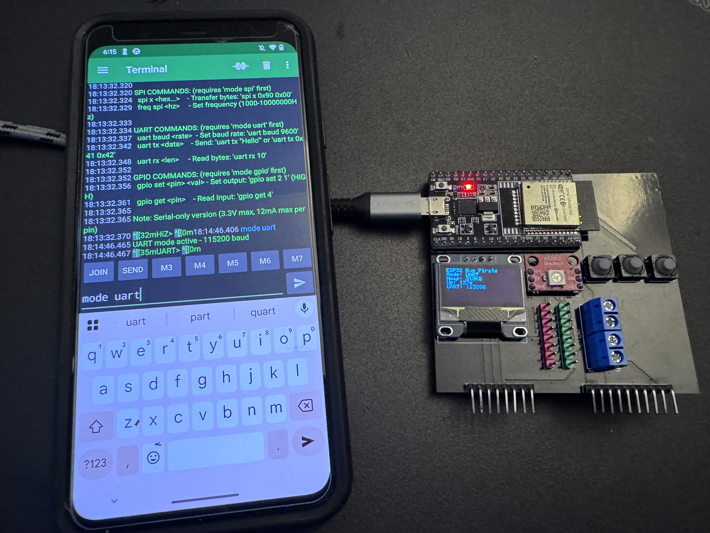
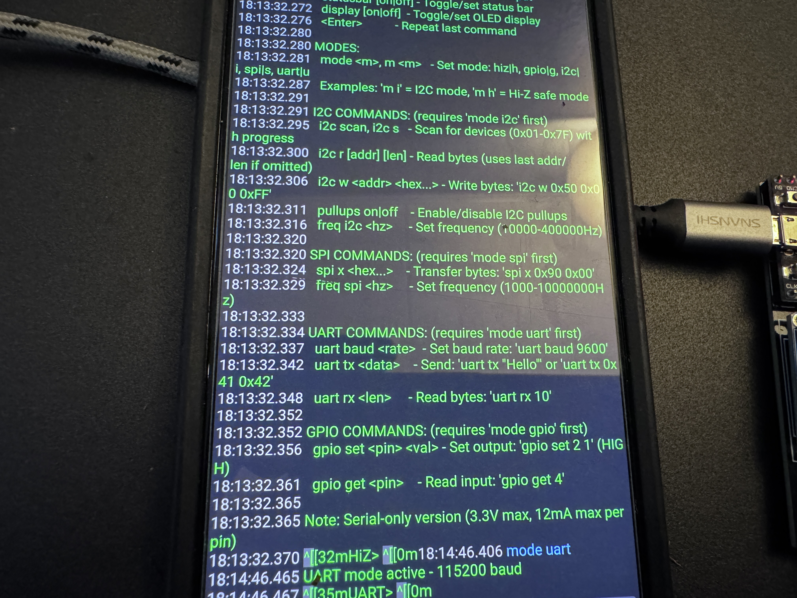
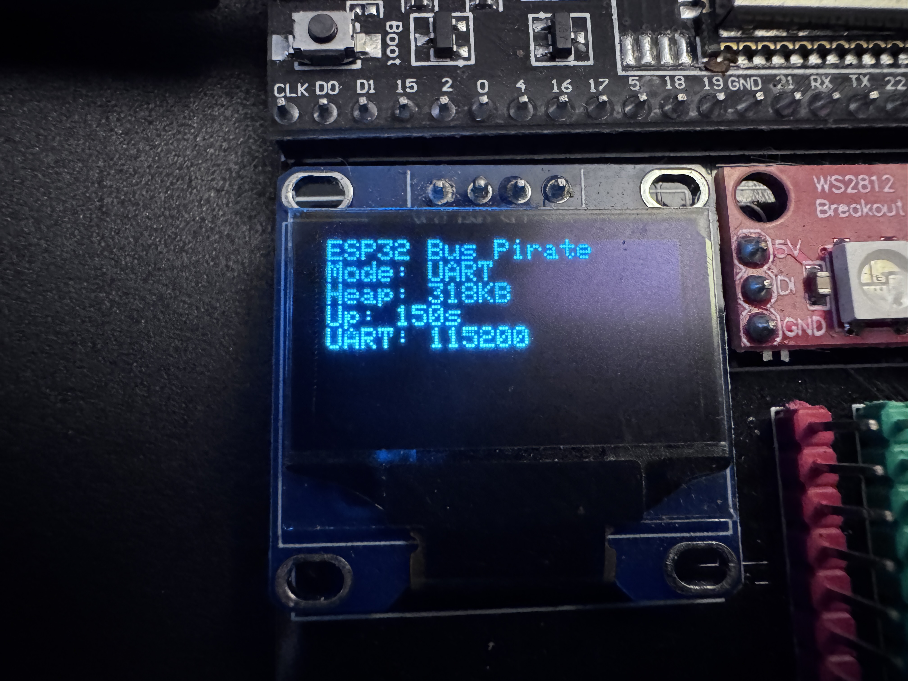
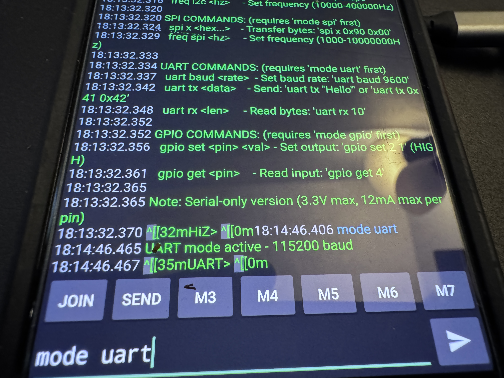

# WireTap-32 - ESP32 Bench Companion

A feature-rich ESP32 implementation of a mini Bus Pirate-style electronics bench tool. WireTap-32 stays serial-first and dev-board friendly, with protocol tools, GPIO controls, simple signal analysis, and an optional OLED GPIO browser driven by three physical buttons.

It also has a compile-time M5Stack Cardputer ADV profile that uses the built-in
screen/keyboard and the EXT 2.54-14P header as the bench connector.

[](https://www.apache.org/licenses/LICENSE-2.0)
[](https://www.arduino.cc/)
[](https://www.espressif.com/en/products/socs/esp32)

## Project Gallery

<p align="center">
  
  
</p>

<p align="center">
  
  
</p>

## Features

### 🔧 Protocol Support
- **I2C**: Scan, ping, identify, register read/write, dump, monitor, EEPROM shell, recovery, slave/logger mode
- **SPI**: Full-duplex transfers, configurable mode/order/frequency, SPI EEPROM shell, SPI flash ID/read helper
- **UART**: TX/RX, auto-baud scan, bridge mode, AT helper, periodic spam mode
- **GPIO**: Digital I/O, ADC, PWM, pulse/frequency checks, ASCII waveform capture
- **Signal Tools**: Frequency/duty estimates, edge counting, ADC stats, PWM test output

### 📟 Display Features
- **SSD1306 OLED Support**: Real-time status display (128x64, 0.96")
- **Live Monitoring**: Current mode, heap usage, uptime, protocol info
- **Auto-Detection**: Gracefully handles missing display

### 🎯 Stability Features
- **Watchdog Safe**: Includes yield calls and timeout handling
- **Memory Management**: Fixed buffers prevent heap fragmentation
- **Error Recovery**: Robust error handling and safe pin states
- **Serial Only**: Eliminates WiFi complexity for maximum reliability
- **Pin Audit**: `pins check` reports unsafe GPIOs, input-only pins, strapping pins, and common conflicts

### 🖲️ Local Controls
- **3-Button OLED Menu**: Navigate a GPIO browser and status screen with the board buttons
- **Hardware Match**: Uses GPIO 34/36/39 with external pullups on the reference board
- **Quick GPIO Test**: Browse safe pins, see their state, and toggle them from the display

### 🎨 User Experience
- **Color Terminal**: ANSI color support for better readability
- **Smart Defaults**: Remembers last used addresses and settings
- **Command History**: Repeat last command with Enter
- **Context Prompts**: Shows current mode in prompt (I2C>, SPI>, etc.)
- **Progress Indicators**: Visual feedback for long operations

## Hardware Requirements

### Basic Setup
- **ESP32 Development Board** (any variant)
- **USB Cable** for programming and serial communication
- **3 tactile buttons** if you want the OLED menu navigation hardware
- **M5Stack Cardputer ADV** if building the Cardputer profile

### Optional Display (Recommended)
- **SSD1306 OLED Display** (128x64, 0.96", I2C interface)
- **4 jumper wires** for I2C connection

### Target Connections
Connect your target devices to the configurable GPIO pins (defaults shown):

| Protocol | Pins | Default GPIO |
|----------|------|--------------|
| I2C | SDA, SCL | 21, 22 |
| SPI | MOSI, MISO, SCK, CS | 23, 19, 18, 5 |
| UART | TX, RX | 17, 16 |
| Display | SDA, SCL | 5, 4 |
| Buttons | LEFT, CENTER, RIGHT | 34, 36, 39 |

### M5Stack Cardputer ADV EXT Header

The Cardputer build uses the EXT 2.54-14P header from the official pinout:

| Role | GPIO |
|---|---|
| SPI SCK | G40 |
| SPI MOSI | G14 |
| SPI MISO | G39 |
| SPI CS | G5 |
| I2C SDA | G8 |
| I2C SCL | G9 |
| UART TX | G15 |
| UART RX | G13 |
| INT input | G4 |
| BUSY input | G6 |

G3 is reset and is reserved. 5VIN, 5VOUT, and GND are power rails, not GPIO.
WireTap-32 still assumes 3.3V target signals; use level shifting for 5V
hardware and keep grounds common.

### Bare ESP32 Limits

WireTap-32 is designed for a plain ESP32 dev board. That keeps it easy to build, but it also means:

- ESP32 GPIO is **3.3V only**. Do not connect 5V signals directly.
- There is no onboard input protection, level shifting, current limiting, or resettable fuse.
- The signal tools are simple GPIO/ADC samplers, not an oscilloscope or high-speed logic analyzer.
- Passive I2C/SPI sniffing is not supported on this bare-board build.
- GPIO 6-11 are tied to onboard flash, GPIO 34-39 are input-only, and strap pins can affect boot.

Run `pins check` before wiring an unfamiliar target. The default OLED SDA pin (`GPIO5`) also overlaps the default SPI CS pin, so move SPI CS with `pins set cs <pin>` when using the OLED and SPI together.

## Quick Start

### 1. Install Libraries
In Arduino IDE, install these libraries via Library Manager:
- **Adafruit GFX Library**
- **Adafruit SSD1306**

### 2. Hardware Setup
```
ESP32 → SSD1306 Display (optional)
  3.3V → VCC
  GND  → GND
  GPIO5 (SDA) → SDA
  GPIO4 (SCL) → SCL
```

### 3. Upload Code
1. Open `WireTap-32.ino` in Arduino IDE
2. Select **Tools → Board → ESP32 Dev Module**
3. Select your COM port
4. Click Upload

Arduino CLI users can compile with:

```bash
arduino-cli compile --fqbn esp32:esp32:esp32 WireTap-32.ino
```

For the M5Stack Cardputer ADV:

```bash
FQBN='m5stack:esp32:m5stack_cardputer:FlashSize=8M,PartitionScheme=default_8MB,CDCOnBoot=cdc,USBMode=hwcdc'
arduino-cli compile --fqbn "$FQBN" \
  --build-property "build.extra_flags=-DESP32 -DWIRETAP_CARDPUTER_ADV=1" .
```

### 4. Connect and Use
1. Open Serial Monitor at **115200 baud**
2. Type `help` to see all available commands
3. Start with `mode i2c` then `i2c scan` to find devices
4. If the OLED/button hardware is installed, use `L/R` to move and `C` to select in the menu

## Command Reference

### Basic Commands
```bash
help                    # Show complete command list
status                  # System information
mode i2c|spi|uart|gpio|hiz  # Set operating mode
pins                    # Show pin assignments
pins check              # Audit unsafe pins and conflicts
pins set sda 25         # Change pin assignments
display on|off          # Control OLED display
```

### I2C Commands
```bash
mode i2c                # Enter I2C mode
i2c scan                # Scan for devices (0x01-0x7F)
i2c ping 0x50           # Probe an address for ACK
i2c identify 0x76       # Guess common device families
i2c read 0x50 0x00 8    # Read 8 bytes from register 0x00
i2c write 0x50 0x00 0xFF # Write bytes to a register
i2c dump 0x50 64        # Dump sequential bytes
i2c monitor 0x50 0 4 500 # Watch register changes
i2c recover             # Try to free a stuck I2C bus
pullups on|off          # Control internal pullups
freq i2c 100000         # Set I2C frequency (Hz)
```

### SPI Commands
```bash
mode spi                # Enter SPI mode
spi x 0x90 0x00        # Transfer bytes (send 0x90, 0x00)
spi flash               # Read SPI flash JEDEC ID / bytes
spi eeprom              # 25xx EEPROM helper shell
freq spi 1000000        # Set SPI frequency (Hz)
```

### UART Commands
```bash
mode uart               # Enter UART mode
uart baud 9600          # Set baud rate
uart tx "Hello"         # Send string
uart tx 0x41 0x42      # Send hex bytes
uart rx 10              # Read up to 10 bytes
uart scan               # Detect common baud rates with traffic
uart bridge             # USB-to-target serial bridge
uart at                 # AT command helper
```

### GPIO Commands
```bash
mode gpio               # Enter GPIO mode
gpio set 2 1           # Set pin 2 HIGH
gpio get 4             # Read pin 4 state
```

### Signal Analyzer Commands
```bash
signal pwmout 25 1000 50 # Generate 1kHz 50% PWM on GPIO25
signal freq 26 1000      # Measure frequency/duty for 1 second on GPIO26
signal edges 26 500      # Count rising/falling edges for 500ms
signal scope 26 80 100   # Capture 80 digital samples, 100us apart
signal adc 34 64         # ADC min/avg/max over 64 samples
```

For a quick loopback demo, jumper GPIO25 to GPIO26, run `signal pwmout 25 1000 50`, then run `signal freq 26 1000`.

## Display Information

When connected, the OLED display shows:
- **System Status**: ESP32 Bus Pirate title
- **GPIO Browser**: One safe pin at a time with `HIGH`, `LOW`, or `INPUT` state
- **Memory Usage**: Free heap in KB
- **Uptime**: System uptime in seconds
- **Protocol Info**: Frequency, baud rate, buffer status
- **Button Menu**: 3-button navigation for GPIO browsing and status screens

The display updates every 500ms and can be toggled with `display on/off` commands. The physical buttons use `L/R` to navigate and `C` to select, toggle, or return.

On Cardputer ADV, use `,` or `;` / `W` / `K` for left, `.` or `/` / `S` /
`J` for right, and `Enter`, `E`, space, or BtnA for select. USB serial remains
the primary command interface.

## Technical Details

### Architecture
- **Arduino Sketch Entrypoint**: `WireTap-32.ino` owns setup, loop, parser, and protocol handlers
- **Small Modules**: `src/SignalTools.*` and `src/PinSafety.*` keep measurement and safety logic separate
- **State Machine**: Clean mode switching with proper cleanup
- **Buffer Management**: Circular buffers for UART with overflow protection
- **Safe Operations**: Timeout handling and resource cleanup
- **Yield Management**: Prevents watchdog resets during long operations

### Pin Safety
- All pins default to safe INPUT state in Hi-Z mode
- Avoids problematic ESP32 pins (6-11, strapping pins)
- 3.3V logic levels, 12mA max current per pin
- Configurable pin assignments at runtime

### Memory Management
- Fixed buffer sizes prevent heap fragmentation
- Limited input parsing prevents memory exhaustion
- Periodic heap monitoring with warnings
- Optimized string handling

## Troubleshooting

### Display Issues
```
Display not found - check I2C connection at 0x3C
```
- Verify SDA/SCL connections (GPIO 21/22 by default)
- Check display I2C address (most SSD1306 use 0x3C)
- Ensure 3.3V power supply to display

### I2C Problems
```
ERROR: I2C begin failed!
```
- Check if display is using same I2C pins
- Try `pins set sda 25` and `pins set scl 26` for alternate pins
- Verify pullup resistors (4.7kΩ recommended)

### Serial Connection
```
No response from device
```
- Verify 115200 baud rate in terminal
- Try different USB cable/port
- Press EN button on ESP32 to reset

## Development

This project uses the Arduino build system and works from Arduino IDE or `arduino-cli`.

### Code Organization
```
WireTap-32.ino          # Main sketch, parser, protocol handlers, OLED UI
src/SignalTools.*       # Signal measurement, ADC stats, PWM output
src/PinSafety.*         # Pin audit and conflict reporting
README.md / USAGE.md    # User-facing docs
DEMOS.md                # Hands-on test ideas
```

### Contributing
1. Fork the repository
2. Create a feature branch
3. Test thoroughly on hardware
4. Submit a pull request

## License

This project is licensed under the Apache-2.0 license - see the [LICENSE](LICENSE) file for details.

## Acknowledgments

- Inspired by the original [Bus Pirate](http://dangerousprototypes.com/docs/Bus_Pirate) by Dangerous Prototypes
- Built on the [Arduino ESP32 Core](https://github.com/espressif/arduino-esp32)
- Uses [Adafruit graphics libraries](https://github.com/adafruit/Adafruit_SSD1306) for display support
---
**⚡ Happy Protocol Debugging! ⚡**
