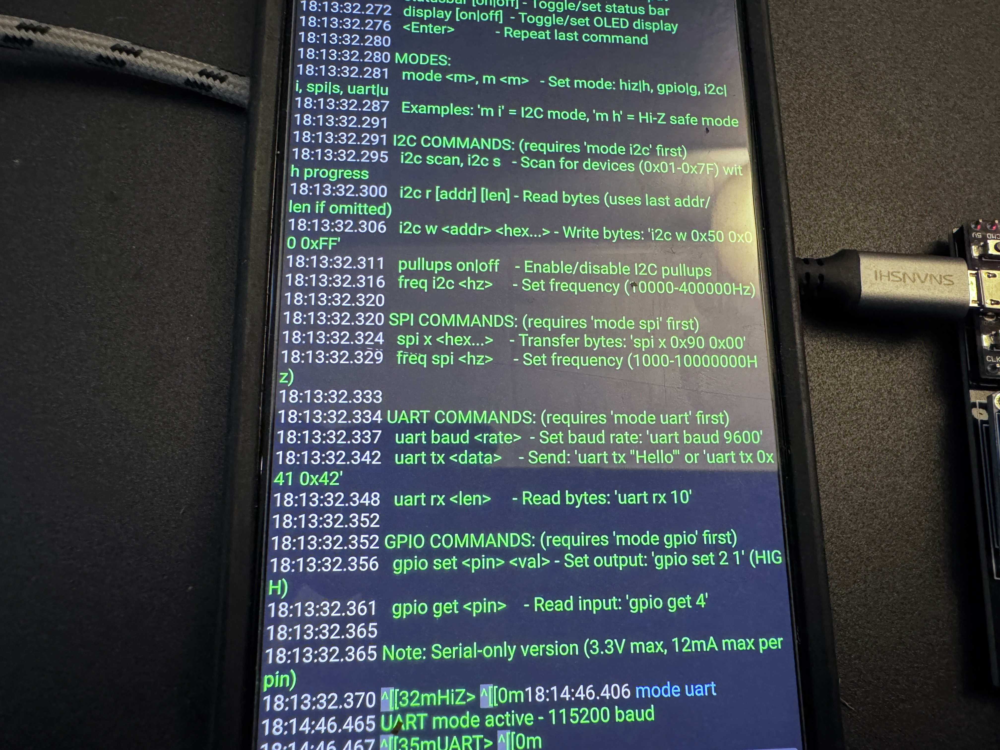
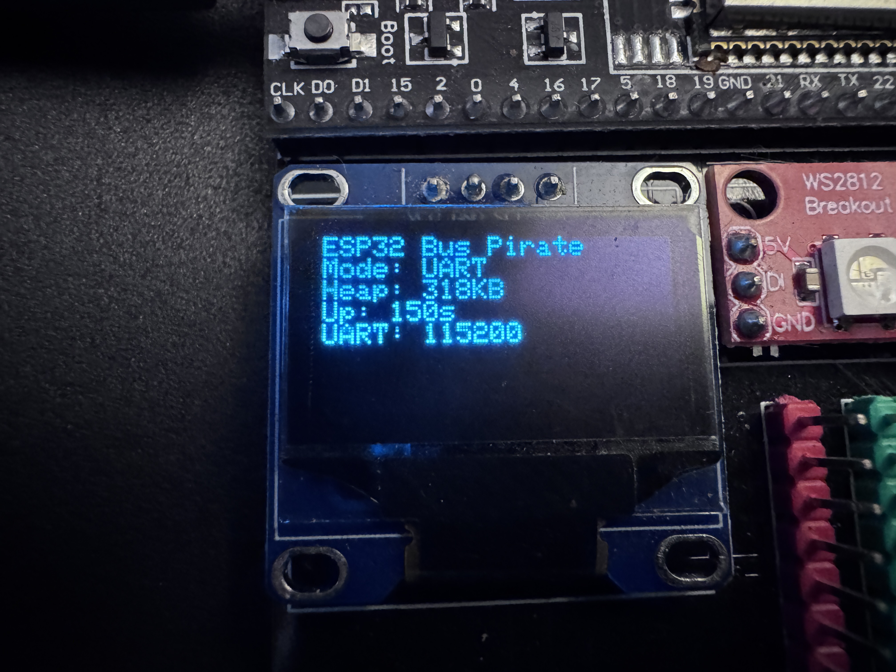

# WireTap-32 - ESP32 Mini Bus Pirate

A feature-rich, single-file ESP32 implementation of the classic Bus Pirate protocol analyzer. This version provides a stable, serial-only interface with optional OLED display support for embedded protocol debugging and analysis.

[](https://opensource.org/licenses/MIT)
[](https://www.arduino.cc/)
[](https://www.espressif.com/en/products/socs/esp32)

## Project Gallery

<p align="center">
  
  
</p>

<p align="center">
  
  
</p>

## Features

### 🔧 Protocol Support
- **I2C**: Scanning, read/write operations with progress indicators
- **SPI**: Full-duplex transfers with configurable parameters
- **UART**: Bidirectional communication with buffering
- **GPIO**: Digital I/O control and monitoring

### 📟 Display Features
- **SSD1306 OLED Support**: Real-time status display (128x64, 0.96")
- **Live Monitoring**: Current mode, heap usage, uptime, protocol info
- **Auto-Detection**: Gracefully handles missing display

### 🎯 Stability Features
- **Watchdog Safe**: Includes yield calls and timeout handling
- **Memory Management**: Fixed buffers prevent heap fragmentation
- **Error Recovery**: Robust error handling and safe pin states
- **Serial Only**: Eliminates WiFi complexity for maximum reliability

### 🎨 User Experience
- **Color Terminal**: ANSI color support for better readability
- **Smart Defaults**: Remembers last used addresses and settings
- **Command History**: Repeat last command with Enter
- **Context Prompts**: Shows current mode in prompt (I2C>, SPI>, etc.)
- **Progress Indicators**: Visual feedback for long operations

## Hardware Requirements

### Basic Setup
- **ESP32 Development Board** (any variant)
- **USB Cable** for programming and serial communication

### Optional Display (Recommended)
- **SSD1306 OLED Display** (128x64, 0.96", I2C interface)
- **4 jumper wires** for I2C connection

### Target Connections
Connect your target devices to the configurable GPIO pins (defaults shown):

| Protocol | Pins | Default GPIO |
|----------|------|--------------|
| I2C | SDA, SCL | 21, 22 |
| SPI | MOSI, MISO, SCK, CS | 23, 19, 18, 5 |
| UART | TX, RX | 17, 16 |
| Display | SDA, SCL (shared with I2C) | 21, 22 |

## Quick Start

### 1. Install Libraries
In Arduino IDE, install these libraries via Library Manager:
- **Adafruit GFX Library**
- **Adafruit SSD1306**

### 2. Hardware Setup
```
ESP32 → SSD1306 Display (optional)
  3.3V → VCC
  GND  → GND
  GPIO21 (SDA) → SDA
  GPIO22 (SCL) → SCL
```

### 3. Upload Code
1. Open `ESP32_BusPirate_Stable.ino` in Arduino IDE
2. Select **Tools → Board → ESP32 Dev Module**
3. Select your COM port
4. Click Upload

### 4. Connect and Use
1. Open Serial Monitor at **115200 baud**
2. Type `help` to see all available commands
3. Start with `mode i2c` then `i2c scan` to find devices

## Command Reference

### Basic Commands
```bash
help                    # Show complete command list
status                  # System information
mode i2c|spi|uart|gpio|hiz  # Set operating mode
pins                    # Show pin assignments
pins set sda 25         # Change pin assignments
display on|off          # Control OLED display
```

### I2C Commands
```bash
mode i2c                # Enter I2C mode
i2c scan                # Scan for devices (0x01-0x7F)
i2c r 0x50 8           # Read 8 bytes from address 0x50
i2c w 0x50 0x00 0xFF   # Write bytes to address 0x50
pullups on|off          # Control internal pullups
freq i2c 100000         # Set I2C frequency (Hz)
```

### SPI Commands
```bash
mode spi                # Enter SPI mode
spi x 0x90 0x00        # Transfer bytes (send 0x90, 0x00)
freq spi 1000000        # Set SPI frequency (Hz)
```

### UART Commands
```bash
mode uart               # Enter UART mode
uart baud 9600          # Set baud rate
uart tx "Hello"         # Send string
uart tx 0x41 0x42      # Send hex bytes
uart rx 10              # Read up to 10 bytes
```

### GPIO Commands
```bash
mode gpio               # Enter GPIO mode
gpio set 2 1           # Set pin 2 HIGH
gpio get 4             # Read pin 4 state
```

## Display Information

When connected, the OLED display shows:
- **System Status**: ESP32 Bus Pirate title
- **Current Mode**: HiZ, I2C, SPI, UART, GPIO
- **Memory Usage**: Free heap in KB
- **Uptime**: System uptime in seconds
- **Protocol Info**: Frequency, baud rate, buffer status

The display updates every 500ms and can be toggled with `display on/off` commands.

## Technical Details

### Architecture
- **Single File**: Complete implementation in one Arduino sketch
- **State Machine**: Clean mode switching with proper cleanup
- **Buffer Management**: Circular buffers for UART with overflow protection
- **Safe Operations**: Timeout handling and resource cleanup
- **Yield Management**: Prevents watchdog resets during long operations

### Pin Safety
- All pins default to safe INPUT state in Hi-Z mode
- Avoids problematic ESP32 pins (6-11, strapping pins)
- 3.3V logic levels, 12mA max current per pin
- Configurable pin assignments at runtime

### Memory Management
- Fixed buffer sizes prevent heap fragmentation
- Limited input parsing prevents memory exhaustion
- Periodic heap monitoring with warnings
- Optimized string handling

## Troubleshooting

### Display Issues
```
Display not found - check I2C connection at 0x3C
```
- Verify SDA/SCL connections (GPIO 21/22 by default)
- Check display I2C address (most SSD1306 use 0x3C)
- Ensure 3.3V power supply to display

### I2C Problems
```
ERROR: I2C begin failed!
```
- Check if display is using same I2C pins
- Try `pins set sda 25` and `pins set scl 26` for alternate pins
- Verify pullup resistors (4.7kΩ recommended)

### Serial Connection
```
No response from device
```
- Verify 115200 baud rate in terminal
- Try different USB cable/port
- Press EN button on ESP32 to reset

## Development

This project uses Arduino IDE's build system. No external build tools required.

### Code Organization
```
ESP32_BusPirate_Stable.ino    # Main source file
├── Protocol Handlers         # I2C, SPI, UART, GPIO functions
├── Command Parser            # Text command processing
├── Display System            # SSD1306 OLED support
├── Utility Functions         # Hex parsing, string handling
└── Stability Framework       # Yield management, error handling
```

### Contributing
1. Fork the repository
2. Create a feature branch
3. Test thoroughly on hardware
4. Submit a pull request

## License

This project is licensed under the Apache-2.0 license - see the [LICENSE](LICENSE) file for details.

## Acknowledgments

- Inspired by the original [Bus Pirate](http://dangerousprototypes.com/docs/Bus_Pirate) by Dangerous Prototypes
- Built on the [Arduino ESP32 Core](https://github.com/espressif/arduino-esp32)
- Uses [Adafruit graphics libraries](https://github.com/adafruit/Adafruit_SSD1306) for display support
---
**⚡ Happy Protocol Debugging! ⚡**
